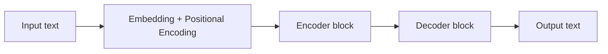

# 1. What is an LLM

## Definition

A **Large Language Model (LLM)** is an AI system that learns patterns from massive amounts of text so it can understand and generate human-like language. It works by predicting the next word in a sentence, but at a very advanced scale - using billions of parameters and the **Transformer architecture**.

In one line: *an LLM is a deep neural network trained on huge text datasets to predict the next token, repeatedly, very well.*

---

## Intuition

Think of an LLM as someone who has read a large fraction of the internet and is really good at one game: *given a partial sentence, what word comes next?*

That single skill - applied at scale - is enough to:

- Understand text
- Answer questions
- Summarize
- Translate
- Generate code, emails, essays

Examples of well-known LLMs: **GPT-4**, **Claude 3**, **Gemini 1.5**, **LLaMA 3**.

---

## How it works (high level)

Every LLM follows the same pipeline.



- **Input** - raw text from the user.
- **Embedding + Positional Encoding** - convert each word into a numerical vector and add information about its position.
- **Encoder block** - reads the input and builds a context-aware representation.
- **Decoder block** - uses that representation to generate the output one token at a time.
- **Output** - the predicted text.

Each of these boxes gets its own chapter in [02-transformer/](../02-transformer/).

---

## Worked example

Task: translate `"I am learning AI"` to French.

```
Input        : "I am learning AI"
Tokenize     : [I, am, learning, AI]
Embed + PE   : [v1, v2, v3, v4]   (each vector ~ 768 to 12288 dims)
Encoder      : produces context vectors for the whole sentence
Decoder      : generates one French word at a time
                step 1 -> "Je"
                step 2 -> "Je apprends"
                step 3 -> "Je apprends l'IA"
Output       : "Je apprends l'IA"
```

The decoder keeps generating until it produces an end-of-sentence token.

---

## Why LLMs are useful

- Understand natural language without explicit programming.
- Perform many tasks (translate, summarize, chat, code) without retraining.
- Automate language-heavy work: documentation, emails, coding assistance.
- Handle huge amounts of text efficiently.

---

## Key takeaways

- An LLM = deep neural network + lots of text + Transformer architecture.
- The core skill is **next-token prediction**.
- The architecture is always: tokenize -> embed -> encoder -> decoder -> output.
- GPT-4, Claude 3, Gemini 1.5, LLaMA 3 are all built on this idea.

---

| Section README | Next |
|---|---|
| [01-fundamentals](./) | [Bag of Words and TF-IDF -&gt;](02-bow-and-tfidf.md) |

[Back to root README](../README.md)
