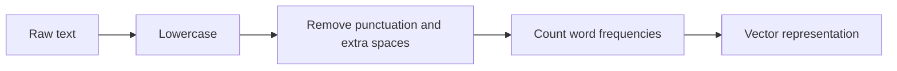
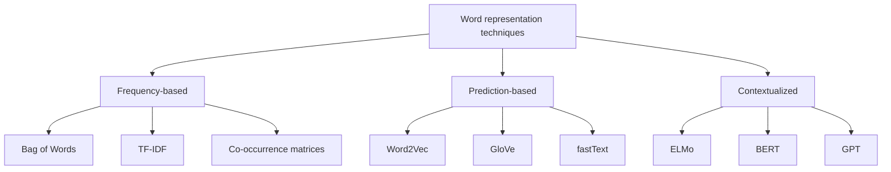

# 2. Bag of Words and TF-IDF

Before we can do attention, embeddings, or transformers, we need to turn text into **numbers**. This chapter covers the simplest two ways: Bag of Words (BoW) and TF-IDF.

---

## 2.1 Bag of Words (BoW)

### Definition

BoW converts a piece of text (sentence, paragraph, document) into a **collection of words and their counts**, ignoring word order and grammar - it only cares about frequency.

### Pipeline



### Steps

1. **Step 1** - Convert text to lowercase.
2. **Step 2** - Remove non-word characters and extra spaces.
3. **Step 3** - Count word frequencies.

---

## 2.2 Count Vectorizer (worked example)

A Count Vectorizer transforms text into a vector based on the frequency of each word in the entire corpus.

**Documents:**

```
document = ["I am a boy", "I ate chicken"]
```

**Vocabulary** (all unique words across documents): `[a, am, ate, boy, chicken, I]`

**Resulting matrix:**

| document      | a | am | ate | boy | chicken | I |
|---------------|---|----|-----|-----|---------|---|
| document[0]   | 1 |  1 |  0  |  1  |    0    | 1 |
| document[1]   | 0 |  0 |  1  |  0  |    1    | 1 |

So `"I am a boy"` becomes the vector `[1, 1, 0, 1, 0, 1]`.

> **Limitation:** BoW captures *frequency* but **no meaning**. The words "good" and "great" look totally unrelated, and word order is lost.

---

## 2.3 Why we need word embeddings

BoW gives us numbers, but they are dumb numbers. We want representations that:

- **Reduce dimensionality** (a vocab of 50,000 words would mean 50,000-dim vectors with BoW).
- **Use a word to predict its surrounding words** (context).
- **Improve interpretability** through numerical meaning.
- **Capture inter-word semantic similarity** (king and queen should be close).

This motivates the family of word-representation techniques.



We will see each of these in the next chapters.

---

## 2.4 TF-IDF

TF-IDF (**Term Frequency - Inverse Document Frequency**) is a smarter frequency-based score. It rewards words that are frequent in *one* document but rare across all documents.

### Formulas

```
TF-IDF(t, d, D) = TF(t, d) * IDF(t, D)

TF(t, d)  = (number of times term t appears in document d)
            / (total number of terms in document d)

IDF(t, D) = log( total documents
                 / number of documents containing term t )
```

### Intuition

- **TF** - if a word shows up many times in this document, it is probably important to it.
- **IDF** - if the word shows up in *every* document (e.g. "the", "is"), it is not very informative, so we down-weight it.
- **TF-IDF score** - high score => the term is important to *that specific* document.

### Mini example

Corpus: 3 documents.
The word `"transformer"` appears 5 times in document A (which has 100 words total) and appears in 1 of the 3 documents.

```
TF  = 5 / 100 = 0.05
IDF = log(3 / 1) = log(3) ≈ 1.0986
TF-IDF ≈ 0.05 * 1.0986 ≈ 0.0549
```

A common stop word like `"the"` would have a much higher TF but `IDF ≈ log(3/3) = 0`, killing its score.

---

## Key takeaways

- BoW and Count Vectorizer are about **counting**, nothing more.
- TF-IDF improves BoW by **down-weighting common words** and **up-weighting distinctive ones**.
- Both are *frequency-based* - they capture no semantic meaning.
- This limitation is exactly what **word embeddings** (next chapter) solve.

---

| &lt;- Previous | Section README | Next -&gt; |
|---|---|---|
| [What is an LLM](01-llm-basics.md) | [01-fundamentals](./) | [Word Embeddings](03-word-embeddings.md) |

[Back to root README](../README.md)
