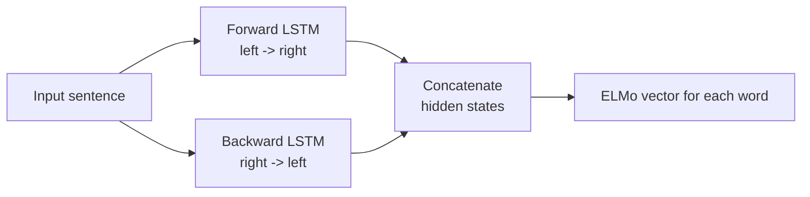

# 4. ELMo and Contextual Embeddings

## The problem with static embeddings

Word2Vec, GloVe, and fastText assign **the same vector** to a word regardless of context. But the same word can mean very different things:

- (A) "She **deposited** money in the **bank**." -> *bank* = financial institution.
- (B) "He sat by the **bank** of the river." -> *bank* = side of a river.

Static embedding methods give `bank` **the same vector** in both sentences. That is wrong.

| method        | bank in (A) | bank in (B) |
|---------------|:-----------:|:-----------:|
| old methods   | same vector | same vector |
| ELMo / BERT   | vector_A    | vector_B    |

We need embeddings that **change with context**.

---

## ELMo - Embeddings from Language Models

**ELMo** produces *contextualized* embeddings that vary based on the surrounding words.

It works in two phases.

### Phase 1 - Pre-training

A bidirectional Language Model (biLM) is trained on a large text corpus. It uses two separate LSTMs:



- **Forward LSTM** reads sentence left-to-right and predicts the *next* word.
- **Backward LSTM** reads sentence right-to-left and predicts the *previous* word.
- The two hidden states are combined for each word.

### Phase 2 - Task-specific integration

Once the biLM is trained, it can be plugged into downstream NLP tasks (sentiment analysis, NER, QA) and each word gets a vector that depends on the **whole sentence**.

---

## Contextual embedding as vector addition

A useful way to think about contextual embedding is: take the static embedding of a word and **add corrections** that capture the influence of every other word in the sentence.

Consider the sentence: `"I made a sweet Indian rice dish called ____"`. We want a contextual embedding for `dish`.

```
   static(dish)        sweetness         riceness         indianness        contextual(dish)

   [ 1.07]             [-0.43]           [ 0.29]          [ 0.39]            [ 1.34]
   [-0.32]      +      [ 0.91]    +      [ 0.67]    +     [-0.11]    =       [ 0.75]
   [  ⋮ ]              [  ⋮ ]            [  ⋮ ]           [-0.98]            [  ⋮ ]
   [  ⋮ ]              [-0.75]           [ 0.85]          [-0.16]            [-1.16]
```

The contextual embedding tells the model **how much `dish` depends on the surrounding words** to predict the next word - here probably `kheer`, `payasam`, or another sweet Indian rice dish.

This is exactly what self-attention will do later, but in parallel and at scale.

---

## ELMo vs static embeddings - summary

| feature                    | Word2Vec / GloVe        | ELMo                                  |
|----------------------------|-------------------------|---------------------------------------|
| Vector per word            | one fixed vector        | depends on surrounding words          |
| Captures polysemy?         | no                      | yes                                   |
| Architecture               | shallow (single layer)  | deep biLSTM                           |
| Use case                   | basic NLP, search       | downstream NLP (NER, sentiment, QA)   |

---

## Why this matters for Transformers

ELMo proved that **contextualized embeddings work better** for downstream tasks. The Transformer takes the same idea but replaces the slow, sequential biLSTM with **parallel self-attention**, which is faster and learns richer relationships.

In other words: ELMo is the bridge between static word embeddings and Transformers.

---

## Key takeaways

- Static embeddings give one vector per word, regardless of context.
- The same word can have different meanings (`bank`-money vs `bank`-river).
- ELMo solves this with a **bidirectional LSTM** that produces a different vector for the same word in different sentences.
- Contextual embedding can be intuitively viewed as: **static embedding + adjustments from context**.
- Transformers take this idea further with self-attention.

---

| &lt;- Previous | Section README | Next -&gt; |
|---|---|---|
| [Word Embeddings](03-word-embeddings.md) | [01-fundamentals](./) | [Architecture Overview](../02-transformer/01-architecture-overview.md) |

[Back to root README](../README.md)
