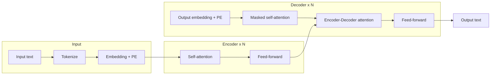

# 1. Transformer - Architecture Overview

## Definition

The **Transformer** is a neural network architecture (Vaswani et al., 2017) that processes sequences using only **attention** - no recurrence (RNN) and no convolution. It is the foundation of every modern LLM.

A Transformer has two parts: an **encoder** and a **decoder**.

---

## The big diagram

- **Encoder** takes the input sentence and produces a **context vector for every word**.
- **Decoder** takes that context plus what it has generated so far, and produces the next word - one token at a time.

---

## What encoder vs decoder actually does

### Encoder

- Reads the full input sentence in **parallel** (no left-to-right wait).
- Each layer = (Self-attention -> Feed-forward).
- Output = a **context-aware embedding** for each input token.

### Decoder

- Generates the output sequence **one token at a time**.
- Each layer = (Masked self-attention -> Encoder-Decoder attention -> Feed-forward).
- *Masked* self-attention means a token can only attend to previously generated tokens (you cannot peek into the future).
- *Encoder-Decoder attention* lets the decoder look back at the encoder's output.

---

## Famous models built on this

| Model  | Tokenizer vocab | Hidden dim | Encoder | Decoder |
|--------|-----------------|------------|:-------:|:-------:|
| BERT   | 30,522 tokens   | 768        |  yes    |   no    |
| GPT-3  | 50,257 tokens   | **12,288** |   no    |  yes    |

Notes:

- **BERT** uses only the **encoder** stack (good for understanding tasks: classification, NER, QA).
- **GPT-3** uses only the **decoder** stack (good for generation: writing, chat, code).
- The full encoder-decoder Transformer is what you use for **sequence-to-sequence** tasks like translation.
- Each token is represented by a **token ID** plus a **static embedding** of size `hidden dim`.

> Note: my handwritten notes had GPT-3's hidden dim as `12228` - the correct value is **`12288`**. Fixed here.

---

## What is a "block"?

A block is one repetition of (attention -> FFN). The original paper uses **N = 6** blocks in both stacks; large models like GPT-3 use **N = 96**. Each block refines the representation a little more.

---

## Key takeaways

- A Transformer = stack of encoder blocks + stack of decoder blocks, glued by attention.
- Encoder = parallel reader. Decoder = step-by-step generator.
- BERT = encoder-only. GPT = decoder-only. Translation models use both.
- Everything else in this section is about the inside of these boxes.

---

| Section README | Next -&gt; |
|---|---|
| [02-transformer](./) | [Positional Encoding](02-positional-encoding.md) |

[Back to root README](../README.md)
