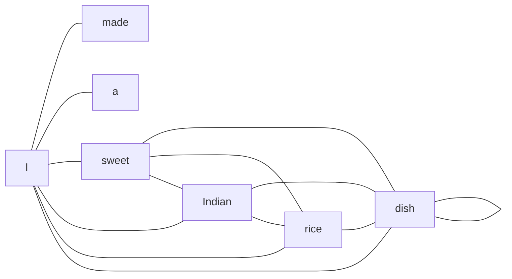

# 3. Self-Attention

## Definition

**Self-attention** is the mechanism that lets each word in a sentence look at every other word and decide *how much it should pay attention to each of them* in order to understand its own meaning in context.

Core idea (memorize this):

> For every word: **how much should I focus on the other words to understand my meaning?**

---

## Why it is needed

Traditional RNN-based encoder-decoder models compress an entire input sentence into **a single vector**. For long sentences, important information gets lost. Self-attention solves this by letting each token directly access every other token, no matter how far apart they are.

Self-attention helps the model **focus on the most important words** in the sentence for each prediction.

---

## Worked example 1 - the John example

Sentence: `"John likes coffee. He went to cafe."`

Question: who is `He`?

```
He looks at every other word:
   John, likes, coffee, went, to, cafe

It assigns importance to each one:

   He -> John   : strong connection
   He -> likes  : weak
   He -> coffee : weak
   He -> went   : medium
   He -> cafe   : medium

Conclusion: He is strongly connected to John.
```

That is self-attention: for the token `He`, the model has computed an *attention weight* to every other token, and the heaviest weight is on `John`.

---

## Worked example 2 - the "rice dish" example

Sentence: `"I made a sweet Indian rice dish called ____"`

We want to predict the next word. Self-attention computes how much the word `dish` should attend to every other word in the sentence.

| word                 | I    | made | a    | sweet  | Indian | rice  | dish   | called |
|----------------------|:----:|:----:|:----:|:------:|:------:|:-----:|:------:|:------:|
| attention from `dish`| 0.7% | 1.1% | 1.4% | 36.3%  |  11%   | 19.3% | 29.2%  |  1%    |

Reading this:

- `dish` cares a lot about `sweet` (36.3%) - the dessert flavor.
- It cares about `rice` (19.3%) and itself (29.2%) - the food category.
- It cares about `Indian` (11%) - the cuisine.
- It mostly ignores `I, made, a, called`.

With these attention weights, the next word is narrowed down to something like `kheer`, `payasam`, etc. Without attention, the next word could be **anything** - that is why attention plays a crucial role.

---

## Visualizing self-attention

Imagine every word emitting a beam to every other word, weighted by relevance.



In a real attention map, every pair of tokens has an edge - the **weight** of the edge is what matters.

A more compact way to think of it is a square matrix:

|       |   I   | made  |  a    | sweet | Indian | rice  | dish  | called |
|-------|:-----:|:-----:|:-----:|:-----:|:------:|:-----:|:-----:|:------:|
| I     |  ...  |  ...  |  ...  |  ...  |  ...   |  ...  |  ...  |  ...   |
| made  |  ...  |  ...  |  ...  |  ...  |  ...   |  ...  |  ...  |  ...   |
| ...   |       |       |       |       |        |       |       |        |
| dish  | 0.7%  | 1.1%  | 1.4%  | 36.3% |  11%   | 19.3% | 29.2% |  1%    |
| ...   |       |       |       |       |        |       |       |        |

The full matrix is `N x N` for an `N`-word sentence. Each row sums to 100%.

---

## Key takeaways

- Self-attention lets every token decide which other tokens are relevant to it.
- It is what gives Transformers their ability to handle long-range dependencies.
- The output is an attention-weighted view of the sentence, *for every word*.
- The actual math (Q, K, V) is in the next chapter.

---

| &lt;- Previous | Section README | Next -&gt; |
|---|---|---|
| [Positional Encoding](02-positional-encoding.md) | [02-transformer](./) | [Query, Key, Value](04-query-key-value.md) |

[Back to root README](../README.md)
