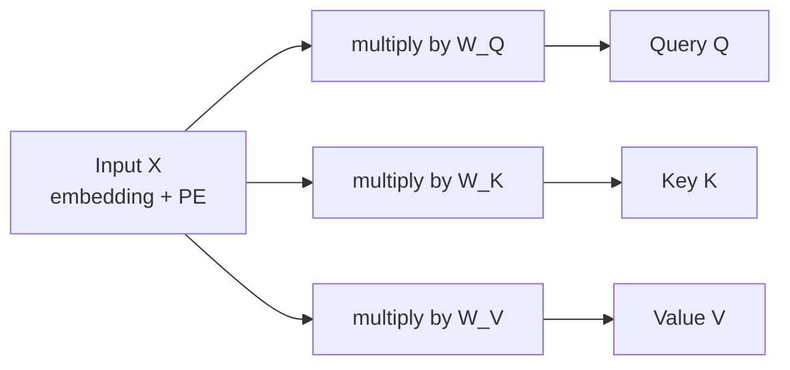

# 4. Query, Key, Value

The previous chapter showed *what* self-attention does. This chapter shows *how* it is computed - using three vectors per token: **Query (Q), Key (K), Value (V)**.

---

## Analogy 1 - the library

You walk into a library and ask the librarian:

- **Query (Q)** - your question: *"I want a quantum mechanics book."*
- **Key (K)** - the **labels on each rack** that the librarian scans to find a match.
- **Value (V)** - the **actual content of the book** sitting on that rack.

The librarian compares your **query** to every **key**, finds the closest matches, then hands you the corresponding **values**.

| role  | what it represents             |
|-------|--------------------------------|
| Query | what I am looking for          |
| Key   | what each item *advertises*    |
| Value | the actual content of the item |

---

## Analogy 2 - the essay group

You have an essay to write: *"Need help writing an essay on quantum computing."*

You ask 4 students.

| student | Key (their skill)            | Value (their essay)        | weight (Q . K) |
|---------|------------------------------|----------------------------|---------------:|
| 1       | I know linear algebra        | Essay 1                    |   10%          |
| 2       | I know quantum mechanics     | Essay 2                    |   60%          |
| 3       | I know philosophy            | Essay 3                    |    1%          |
| 4       | I know computer science      | Essay 4                    |   29%          |

You will pull most help from student 2 (60%) and student 4 (29%). Mathematically:

```
output = 0.10 * Essay1 + 0.60 * Essay2 + 0.01 * Essay3 + 0.29 * Essay4
```

That is **exactly** how self-attention combines value vectors. **(Query . Key)** gives you a percentage; you multiply that percentage with **Value**.

---

## How Q, K, V are computed

Each token already has an input vector `x` (embedding + positional encoding). To get its Q, K, V, we multiply by three **learned weight matrices**:

```
Q = X . W_Q
K = X . W_K
V = X . W_V
```



If a sentence has 8 tokens, we end up with three sets of 8 vectors:

```
Q = (q_1, q_2, q_3, ..., q_8)   <- one query per token
K = (k_1, k_2, k_3, ..., k_8)   <- one key per token
V = (v_1, v_2, v_3, ..., v_8)   <- one value per token
```

`W_Q`, `W_K`, `W_V` are **the parameters the model learns during training**.

---

## Worked example - "I made a sweet Indian rice dish called ____"

We want the attention output for the word `dish` (token 7). We compute the dot product of `q_7` against every key, then softmax those scores.

```
Token     dot product  ->   softmax  ( probability )
   I         q7 . k1ᵀ = 2.1   ─────►     0.9 %
   made      q7 . k2ᵀ = 3.3   ─────►     1.1 %
   a         q7 . k3ᵀ = 4.2   ─────►     1.4 %
   sweet     q7 . k4ᵀ = 10    ─────►    36.3 %
   Indian    q7 . k5ᵀ = 33    ─────►    11.0 %
   rice      q7 . k6ᵀ = 57    ─────►    19.3 %
   dish      q7 . k7ᵀ = 87    ─────►    29.2 %
   called    q7 . k8ᵀ = ...   ─────►     1.0 %
```

Now we multiply each probability by the corresponding **value vector** and add them up:

```
attention(dish) = 0.009 * v_1
                + 0.011 * v_2
                + 0.014 * v_3
                + 0.363 * v_4
                + 0.110 * v_5
                + 0.193 * v_6
                + 0.292 * v_7
                + 0.010 * v_8
```

The result is a **single context-aware vector** representing `dish` in this specific sentence.

---

## The full formula

Putting it all together for the whole sentence:

```
Attention(Q, K, V) = softmax( Q . Kᵀ / sqrt(d_k) ) . V
```

Where:

- `Q . Kᵀ` is an `N x N` matrix of all dot products.
- `softmax` is applied **row-wise** so each row sums to 1.
- `sqrt(d_k)` (square root of the key dimension) is a scaling factor that prevents the dot products from getting too large and saturating the softmax.
- The final multiplication with `V` gives an `N x d_v` matrix - one context-aware vector per token.

---

## Step-by-step summary

1. From input `X`, compute `Q = X.W_Q`, `K = X.W_K`, `V = X.W_V`.
2. Compute attention scores `Q.Kᵀ`.
3. Scale by `sqrt(d_k)`.
4. Apply softmax row-wise -> attention weights (probabilities).
5. Multiply weights by `V` -> context-aware embeddings.

This whole process is fully differentiable and runs in parallel for all tokens.

---

## Key takeaways

- Q, K, V come from the **same input** but use different learned matrices.
- Q asks the question; K advertises; V holds the content.
- `softmax(Q.Kᵀ / sqrt(d_k))` produces the attention weights (a probability distribution per token).
- Multiplying by V gives the new, context-aware vector for each token.
- This is the **core operation** of every Transformer.

---

| &lt;- Previous | Section README | Next -&gt; |
|---|---|---|
| [Self-Attention](03-self-attention.md) | [02-transformer](./) | [Multi-Head Attention](05-multi-head-attention.md) |

[Back to root README](../README.md)
