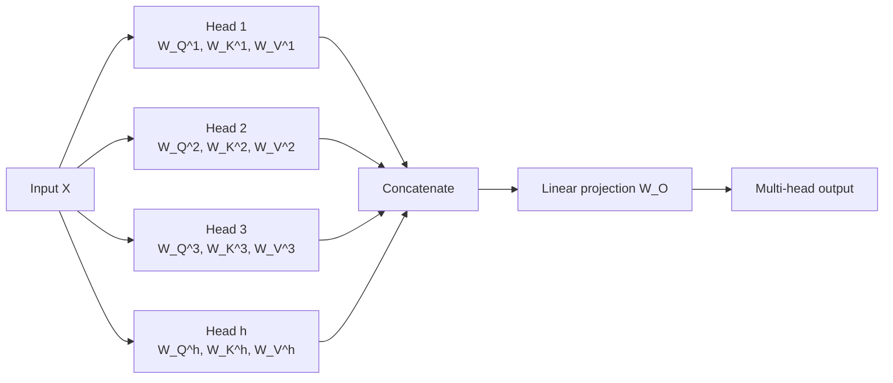

# 5. Multi-Head Attention

## Definition

**Multi-Head Attention (MHA)** runs the self-attention mechanism **multiple times in parallel**, each with its own learned `W_Q, W_K, W_V`. The outputs are concatenated and linearly projected.

In one line: *one attention head sees one kind of relationship; many heads see many*.

---

## Why one head is not enough

A single attention head learns one type of relationship between tokens. Real language has many relationships at the same time:

- **Semantic** - what does this word mean?
- **Positional / structural** - where is it in the sentence?
- **Syntactic** - what is its grammatical role (subject, verb, object)?
- **Coreference** - what does this pronoun refer to?

Going back to a real-world analogy: when you look at a photo, you don't just notice the *adjectives* describing one person. You also notice **who** the person is, **where** they are, and **what** they are doing. Each of those is a separate "lens" on the same scene.

Multi-head attention gives the model **multiple lenses** simultaneously.

---

## How it works



Each head:

1. Has its own `W_Q^i, W_K^i, W_V^i` (smaller dimensions than the full embedding).
2. Performs the same `softmax(Q.Kᵀ / sqrt(d_k)) . V` computation.
3. Produces its own context-aware embeddings.

Then all heads' outputs are **concatenated** and passed through a final linear layer `W_O`.

---

## The formulas

```
head_i = Attention(Q . W_Q^i, K . W_K^i, V . W_V^i)

MultiHead(Q, K, V) = Concat(head_1, head_2, ..., head_h) . W_O
```

The original Transformer paper uses **`h = 8` heads**.

---

## Intuition - what each head might learn

In a trained Transformer, different heads end up specializing:

| head    | might focus on...                  |
|---------|------------------------------------|
| head 1  | adjacent words (local syntax)      |
| head 2  | subject-verb agreement             |
| head 3  | coreference (pronouns -> nouns)    |
| head 4  | semantic similarity                |
| head 5  | rare-word handling                 |
| ...     | ...                                |

We don't program these specializations; they emerge from training. Each head produces a **context-aware embedding**, and we add (concatenate) them together to get a final, richer **contextual embedding**.

---

## Key takeaways

- One attention head = one relationship lens.
- Multi-head attention = multiple lenses in parallel.
- Each head has its own learned `W_Q^i, W_K^i, W_V^i`.
- Outputs are concatenated and projected with `W_O`.
- The result: each token's embedding captures **semantic + syntactic + positional + coreference** signals at once.

---

| &lt;- Previous | Section README | Next -&gt; |
|---|---|---|
| [Query, Key, Value](04-query-key-value.md) | [02-transformer](./) | [Feed-Forward Network](06-feed-forward-network.md) |

[Back to root README](../README.md)
