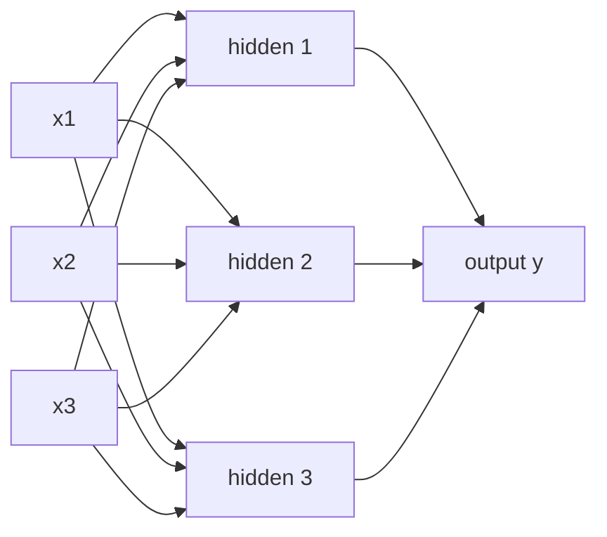

# 6. Feed-Forward Network

## Definition

A **Feed-Forward Network (FFN)** in a Transformer is a small, position-wise neural network that processes each token's vector **independently** after multi-head attention. It is the second sub-layer of every encoder/decoder block.

In one line: *attention mixes tokens; FFN refines each token on its own.*

---

## Why we need it

After multi-head attention, every token has a context-aware vector `z_i`. But that vector is essentially a *weighted average* of value vectors - mostly linear. The FFN adds a **non-linear transformation** to each position so the model can capture complex patterns and higher-order features.

> Multi-head attention answers *who relates to whom*. The FFN answers *given that, what does this token become*?

---

## The structure

A feed-forward network is the simplest type of artificial neural network: information flows in one direction (input -> hidden -> output), with **no loops or feedback**.



| layer        | role                                                          |
|--------------|---------------------------------------------------------------|
| Input layer  | accepts input data; one neuron per feature                    |
| Hidden layer | weighted sum of inputs + non-linear activation function       |
| Output layer | produces the final output                                     |

In a Transformer, each token's vector `z_i` is run through this small network independently.

---

## The math

For each token's vector `z`, the position-wise FFN is:

```
FFN(z) = max(0, z . W_1 + b_1) . W_2 + b_2
```

That is two linear layers with a **ReLU** in between:

1. Linear up-projection (`W_1`) to a higher dimension (typically 4 x d_model).
2. ReLU non-linearity.
3. Linear down-projection (`W_2`) back to `d_model`.

So if `d_model = 768`, the inner layer is usually `3072` wide.

---

## Position-wise: a key property

The FFN is applied **independently to every token**. That is, the same `W_1, W_2` are used for token 1, token 2, token 3, ... and the tokens **do not interact** at this stage.

```
   z_1  ----FFN--->  out_1
   z_2  ----FFN--->  out_2
   z_3  ----FFN--->  out_3
   ...               ...
   z_N  ----FFN--->  out_N
```

That is why we say it is "position-wise" - because every position uses the same network, but each position is processed on its own.

---

## Why ReLU and non-linearity matter

Without a non-linear activation, stacking linear layers would just be one big linear layer. Non-linearity (ReLU, GELU, etc.) lets the network model **complex, non-linear** relationships:

```
ReLU(x) = max(0, x)
```

Simple, fast, and effective. Modern Transformers (GPT-3, LLaMA) often use **GELU** or **SwiGLU**, which are smoother variants.

---

## Where it sits in a block

```
Input
  |
  +--->  Multi-Head Self-Attention
  |
  +--->  Add & LayerNorm
  |
  +--->  Feed-Forward Network        <-- you are here
  |
  +--->  Add & LayerNorm
  |
  v
Output
```

Each encoder/decoder block has exactly **one** FFN sub-layer.

---

## Key takeaways

- The FFN is a small two-layer NN with a non-linearity in between.
- It is applied **position-wise** - same weights for every token, no token-to-token interaction.
- It enriches each token's embedding by capturing complex, non-linear patterns.
- Together with multi-head attention, it forms one full encoder/decoder block.

---

| &lt;- Previous | Section README | Next -&gt; |
|---|---|---|
| [Multi-Head Attention](05-multi-head-attention.md) | [02-transformer](./) | [Encoder-Decoder Flow](07-encoder-decoder-flow.md) |

[Back to root README](../README.md)
