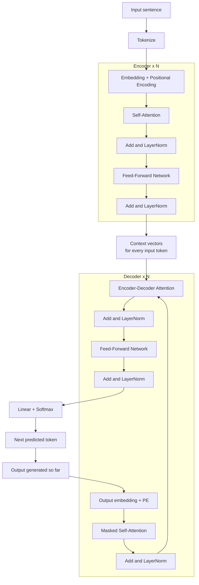

# 7. Encoder-Decoder Flow

This chapter assembles every piece we have built so far - embeddings, positional encoding, self-attention, multi-head attention, feed-forward - into the **end-to-end Transformer**. We follow a single sentence through the entire pipeline.

---

## Why encoder-decoder?

Encoder-Decoder models are used for tasks where the input and output are **both sequences**, often of different lengths:

- Machine translation (`English -> French`)
- Summarization (`long article -> short summary`)
- Question answering (`question + context -> answer`)

The **encoder** processes the input and converts it into a form the model can understand. The **decoder** uses that representation to generate the output.

---

## The full diagram



The decoder loops on itself: each generated token is fed back in to predict the next.

---

## What each side does

### Encoder

Processes the input and converts it into a form the model can understand.

1. **Self-attention layer** - helps the encoder focus on different parts of the input data that are important for understanding the context.
2. **Feed-forward network** - after self-attention, this NN processes the info further to capture complex hidden patterns in the data.

### Decoder

Takes the processed info and generates the output.

1. **Masked self-attention layer** - allows the decoder to focus on different parts of the output it has already generated (you cannot peek at future tokens).
2. **Encoder-Decoder attention layer** - this unique layer enables the decoder to focus on different parts of the input data, helping it generate more accurate outputs.
3. **Feed-forward network** - used to process info and generate the final output.

---

## Step-by-step walkthrough

We will translate the sentence `"I am learning AI"` from English to (any target language) using an encoder-decoder Transformer.

### Step 1 - Tokenizing the input sentence

```
"I am learning AI"   ──tokenize──►   ["I", "am", "learning", "AI"]
```

Each token is converted into a vector that the machine can understand (embedding lookup).

### Step 2 - Encoding the input

The encoder processes these embeddings using **self-attention**. It helps focus on important words. Now the encoder generates a **context vector** which captures the meaning of the entire sentence.

### Step 3 - Passing the context to the decoder

The context is passed to the decoder. It is like a summary of the full sentence in a form the machine can understand.

### Step 4 - Decoder generates output step-by-step

- Uses the context and starts creating the output **one word at a time**.
- First, predict one word, then use it to predict the next, and so on.

### Step 5 - Decoder attention

While generating each word, the decoder attends to different parts of the input sentence to make better predictions (this is the **encoder-decoder attention**).

### Step 6 - Producing the final output

The decoder continues to generate until the **full translated sentence** is produced (or it emits an end-of-sentence token).

---

## What the decoder loop looks like

```
Step 1:  decoder input = [<start>]
         decoder output = "Je"

Step 2:  decoder input = [<start>, "Je"]
         decoder output = "apprends"

Step 3:  decoder input = [<start>, "Je", "apprends"]
         decoder output = "l'IA"

Step 4:  decoder input = [<start>, "Je", "apprends", "l'IA"]
         decoder output = "<end>"   ──► stop
```

At every step, the decoder uses:

- **Masked self-attention** over what it has generated so far.
- **Encoder-decoder attention** over the entire input sentence.
- **Feed-forward** for non-linear refinement.
- **Linear + Softmax** to pick the next token.

---

## Encoder vs Decoder - quick comparison

| feature                      | Encoder              | Decoder                     |
|------------------------------|----------------------|-----------------------------|
| Self-attention type          | unmasked             | masked (no peeking ahead)   |
| Has Encoder-Decoder Attn?    | no                   | yes                         |
| Sees full input?             | yes (in parallel)    | yes (via cross-attention)   |
| Generates tokens?            | no                   | yes (one at a time)         |

---

## Key takeaways

- Encoder = parallel reader that builds context.
- Decoder = autoregressive generator that consumes context + own past tokens.
- Three attention layers in the model: encoder self-attn, decoder masked self-attn, encoder-decoder attn.
- The decoder loops until it emits an end-of-sentence token.
- This is the architecture behind translation, summarization, and seq2seq generation.

---

| &lt;- Previous | Section README | Next -&gt; |
|---|---|---|
| [Feed-Forward Network](06-feed-forward-network.md) | [02-transformer](./) | [Activation Functions](../03-supporting-concepts/01-activation-functions.md) |

[Back to root README](../README.md)
