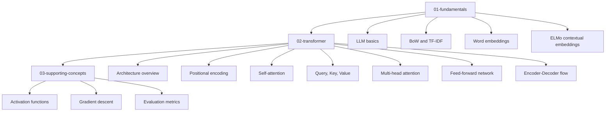
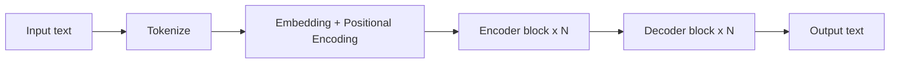
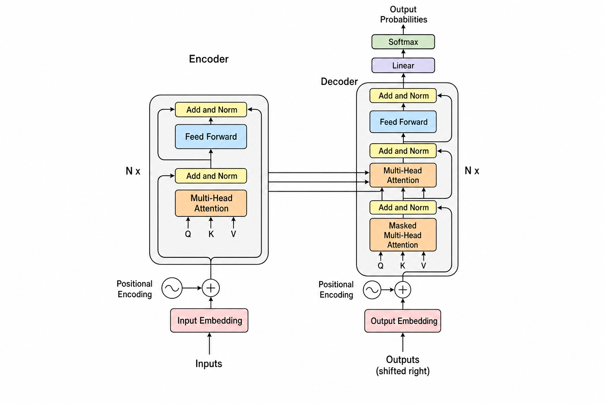

# Transformer Notes

A clean, beginner-friendly walkthrough of how Transformers and Large Language Models work, written as my personal learning resource.

The goal is simple: every concept here is taught the same way I learn best — with a one-line definition, a clear intuition, a worked example with real numbers or words, and a diagram. No equations dropped without explanation, and no concept introduced without an example.

---

## How to read this repo

Read the folders in order. Each section builds on the previous one.

---

## The big picture

Before diving in, here is what an LLM does end-to-end. Everything in this repo is one of the boxes below.

### The original Transformer architecture

The diagram below is the canonical architecture from the **"Attention Is All You Need"** paper (Vaswani et al., 2017). Every concept in this repo is one of the colored boxes.

Want to see this in action? The [Transformer Explainer](https://poloclub.github.io/transformer-explainer/) lets you step through a live GPT-2 model in your browser - watch tokenization, Q/K/V, attention maps, and softmax happen on real input. Highly recommended.

---

## Table of Contents

### 01 - Fundamentals

1. [What is an LLM](01-fundamentals/01-llm-basics.md)
2. [Bag of Words and TF-IDF](01-fundamentals/02-bow-and-tfidf.md)
3. [Word Embeddings (Word2Vec, GloVe, fastText)](01-fundamentals/03-word-embeddings.md)
4. [ELMo and Contextual Embeddings](01-fundamentals/04-elmo-contextual.md)

### 02 - Transformer

1. [Architecture Overview](02-transformer/01-architecture-overview.md)
2. [Positional Encoding](02-transformer/02-positional-encoding.md)
3. [Self-Attention](02-transformer/03-self-attention.md)
4. [Query, Key, Value](02-transformer/04-query-key-value.md)
5. [Multi-Head Attention](02-transformer/05-multi-head-attention.md)
6. [Feed-Forward Network](02-transformer/06-feed-forward-network.md)
7. [Encoder-Decoder Flow](02-transformer/07-encoder-decoder-flow.md)

### 03 - Supporting Concepts

1. [Activation Functions](03-supporting-concepts/01-activation-functions.md)
2. [Gradient Descent](03-supporting-concepts/02-gradient-descent.md)
3. [Evaluation Metrics](03-supporting-concepts/03-evaluation-metrics.md)

---

## References

- **Paper:** [Attention Is All You Need (Vaswani et al., 2017)](https://arxiv.org/abs/1706.03762)
- **Article:** [GeeksforGeeks - Transformers in Machine Learning](https://www.geeksforgeeks.org/getting-started-with-transformers/)
- **Article:** [GeeksforGeeks - Self-Attention in NLP](https://www.geeksforgeeks.org/self-attention-in-nlp/)
- **Video:** [codebasics - Transformer Architecture (YouTube)](https://www.youtube.com/watch?v=TQQlZhbC5ps)
- **Interactive:** [Transformer Explainer - poloclub.github.io](https://poloclub.github.io/transformer-explainer/)
- **Bonus:** [The Illustrated Transformer - Jay Alammar](https://jalammar.github.io/illustrated-transformer/)

Full annotated list: [references.md](references.md).
